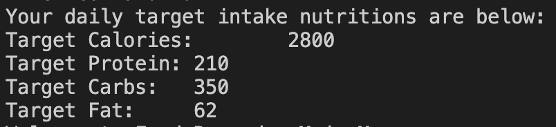
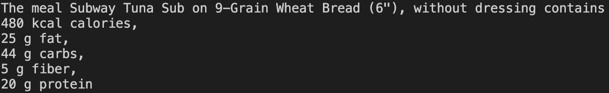
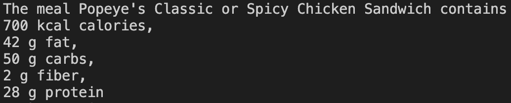
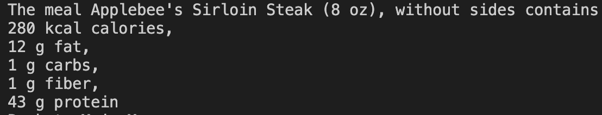
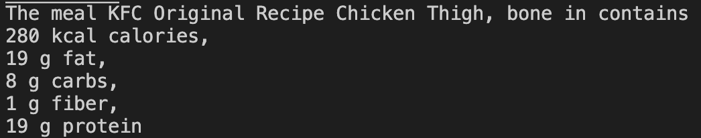
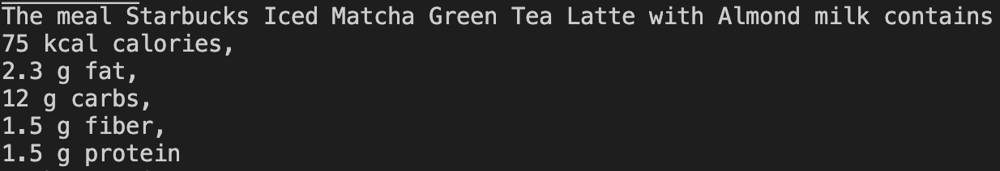
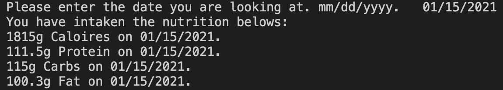
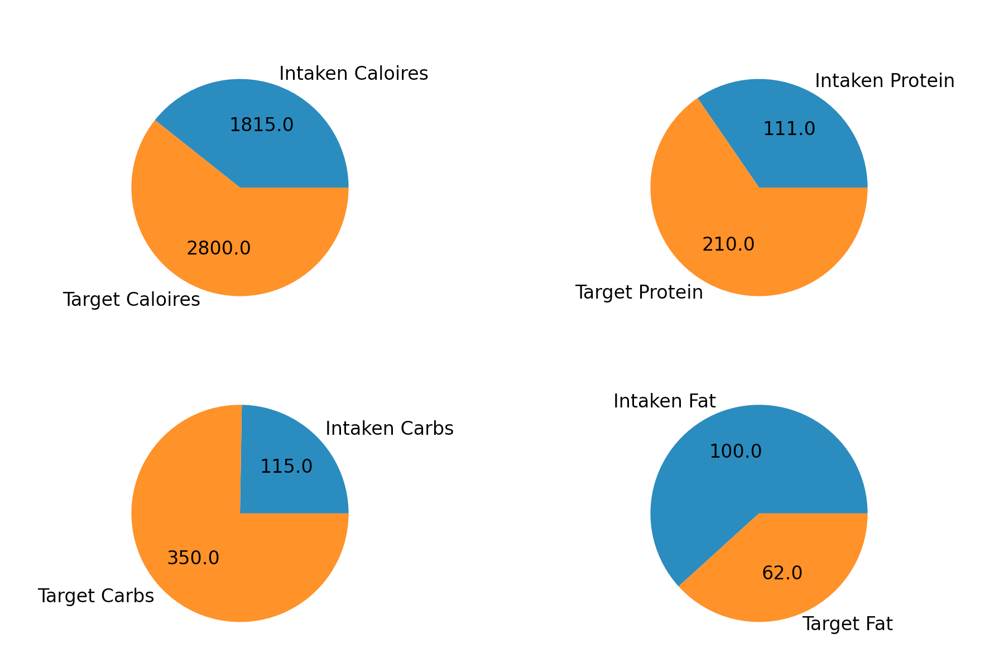

# food_nutrition_calculator
<em>Will Huang</em>
 

## Project Summary

This project is a food nutritions recording program that parses food data from [CalorieKing](
https://www.calorieking.com/us/en/) and stores the nutritions information into a postgreSQL database.  
A user can query the database to see if a certain day meet the daily target intake nutritions, also can read the full intake record from food_recorder.csv file.

<ol>
<li>To begin I created a postgreSQL database, food, via PgAdmin. </li>
<li>Next, I used QuickDBD to create the schemea of the food database with 3 tables, including Food table, User table, and Record table.</li>
<li>Next, I exported the schema as a SQL script.</li>
<li>Next, I ran the SQL script in PgAdmin to create the talbes and the relationships.</li>
<li>Lastly, I wrote the parsing, storing, and visulizing functions for the program with Python.</li>
<li>At this point, a user can type in the resetaurant's name and the meal name to search for the nutritions of the meal. The program will store the data into database and provid the function of visualizing the daily target nutritions and daily intaken nutritions with pie plots.
</li>
</ol>

## How to Run

### Prerequisite
<ul>
    <li>PostgreSQL
    </li>
     <li>PgAdmin
    </li>
     <li>Python and Python Package includes:
    </li>
    <ul>
        <li>Pandas
        </li>
        <li>SQLAlchemy
        </li>
        <li>Numpy
        </li>
        <li>selenium
        </li>
        <li>matplotlib
        </li>
        <li>flask
        </li>
    </ul>
</ul>

### Setup Database
<ol>
    <li>Open PgAdmin and Create a database named "food".
    </li>
    <li>Run food_schema.sql script in PgAdmin.
    </li>
</ol>

### Run Program
<ol>
    <li>Open a Terminal
    </li>
    <li>Type "python main.py" in the terminal to run the food_nutrition_calculator program.
    </li>
    <li>Enter the letters to activate corresponding  function.
    </li>
</ol>

#### Enter User Info If It Is the First Time of Using the Program

<ol>
    <li>Enter Weight
    </li>
    <li>Enter Activtiy Level: "A---Light\nB---Mediumn\nC---Heavy"
    </li>
    <li>Enter Diet Purpose:
    "A---Gain Weight\nB---Keep Weight\nC---Loss Weight"
    </li>
</ol>

#### Main Functions

<ul>
<li>'A' => Add to Record</li>
<li>'V' => View Daily Intake</li>
<li>'U  => View Daily Target Intake</li>
<li>'Q' => Quit</li>
</ul>

## Example
Sample User Information:
<ul>
    <li>User Weight: 70
    </li>
    <li>Activity Level: (B) Medium
    </li>
    <li>Diet Purpose: (A) Gain Weight
    </li>
    <li>User Target Daily Intake
    
    </li>
</ul>

Sample User's Diet Records:
<ul>
Date: 01/15/2021
    <li>Breakfast: Subway Tuna Sub on 9-Grain Wheat Bread (6"), without dressing
    
    </li>
    <li>Lunch: Popeye's Classic or Spicy Chicken Sandwich
    
    </li>
    <li>Dinner: Applebee's Sirloin Steak (8 oz), without sides
    
    </li>
    <li>Other: KFC Original Recipe Chicken Thigh, bone in
    
    </li>
    <li>Other: Starbucks Matcha Green Tea Latte with Almond milk
    
    </li>
</ul>

Sample User's Daily Intaken Condition Visuals: 
<ul>
Date: 01/13/2021

</ul>